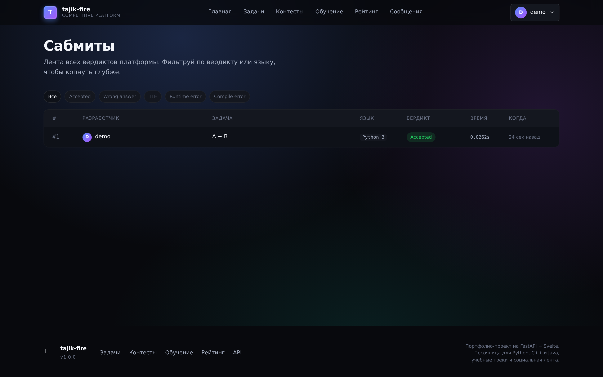
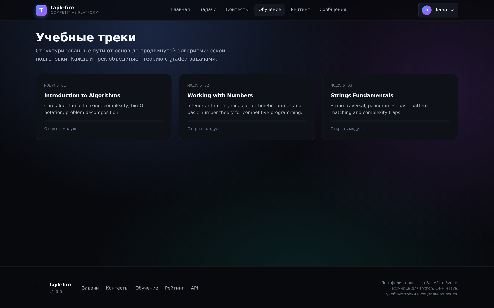
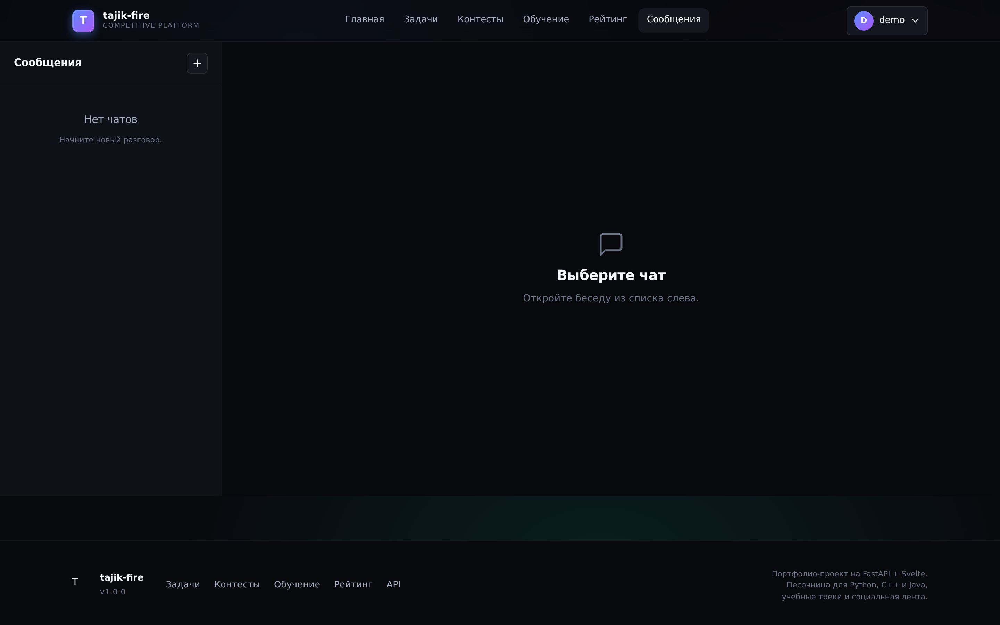
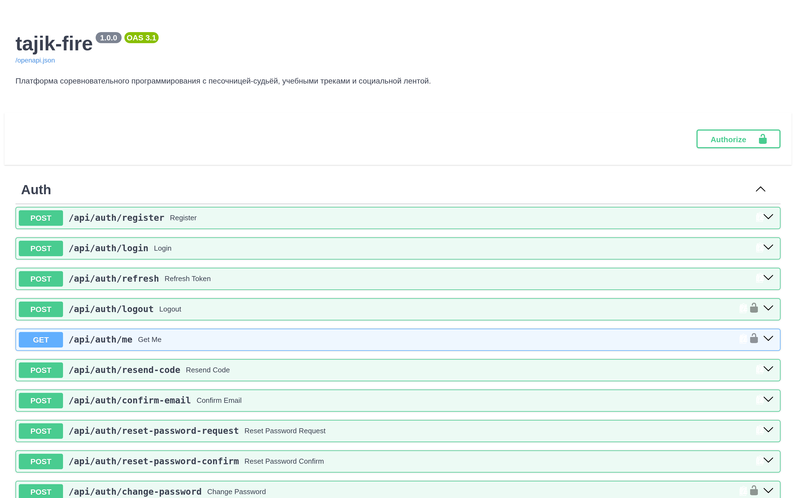

# DevStudio Pro

<p align="center">
  <strong>A competitive programming platform with a sandboxed code judger, structured learning tracks, social features and a real-time submission feed.</strong>
</p>

<p align="center">
  <a href="https://github.com/tajik-fire/tajik-fire.github.io/actions"></a>
  
  
  
  
  
  
  
</p>

<p align="center">
  <a href="#highlights">Highlights</a> ·
  <a href="#screenshots">Screenshots</a> ·
  <a href="#quick-start">Quick start</a> ·
  <a href="#architecture-at-a-glance">Architecture</a> ·
  <a href="#api-reference">API</a> ·
  <a href="#deployment">Deployment</a> ·
  <a href="#roadmap">Roadmap</a>
</p>

---

DevStudio Pro is a single-product repository for a competitive programming
platform — think Codeforces meets a study tracker. It ships a backend that
judges Python, C++ and Java submissions in an isolated subprocess, a problem
archive with three difficulty tiers and translated statements (English,
Russian, Tajik), structured learning tracks, a social layer with friend
requests and direct/group chats, a personal task board, a live submission
feed, and a global leaderboard.

The frontend is **vanilla ES modules + a hand-rolled design system**, no
build step required. The whole thing boots in one `uvicorn` process and
seeds a fully working demo dataset on first start.

---

## Highlights

- **Sandboxed judger** — each submission runs in an isolated subprocess with
  memory and CPU caps, then is matched against sample and hidden test cases.
  Python 3, C++ 17 and Java 11 are supported out of the box.
- **JWT auth with refresh tokens** — short-lived access tokens, 7-day refresh
  tokens, login-attempt throttling and bcrypt password hashing.
- **Email-optional onboarding** — when SMTP is not configured, verification
  codes are returned in the API response so you can develop locally without
  an inbox. Flip one env var to ship real emails via SMTP.
- **i18n problem statements** — every problem ships with three translations
  (EN / RU / TJ). The `/problems/{id}?lang=…` endpoint serves the right
  statement per request.
- **Real-time submission feed** — every judged submission is written to a
  denormalized feed table and surfaced on the dashboard, home page and a
  dedicated submissions page.
- **Rating system** — first-solve grants rating points scaled by difficulty
  (easy +5, medium +12, hard +25), which feeds the leaderboard.
- **No build step** — frontend is plain ES modules, the design system is
  hand-rolled CSS variables. Drop into a static file server and you're done.
- **CI out of the box** — GitHub Actions runs ruff lint, smoke-tests the
  app and exercises the judger pipeline on every push.

---

## Screenshots

The UI ships in a dark theme with an aurora gradient background. Each
screenshot below corresponds to a screen in the running app — replace the
placeholder `.png` files in [`docs/screenshots/`](./docs/screenshots/) with
real captures and the README will render them automatically.

<table>
  <tr>
    <td width="50%" align="center"><b>Landing & dashboard</b></td>
    <td width="50%" align="center"><b>Problem archive</b></td>
  </tr>
  <tr>
    <td></td>
    <td></td>
  </tr>
  <tr>
    <td align="center"><sub>Hero with live counters, code-tab preview and CTA</sub></td>
    <td align="center"><sub>Filter by difficulty, category, search; sort by ID or solved count</sub></td>
  </tr>
  <tr>
    <td width="50%" align="center"><b>Code editor + verdict</b></td>
    <td width="50%" align="center"><b>Leaderboard</b></td>
  </tr>
  <tr>
    <td></td>
    <td></td>
  </tr>
  <tr>
    <td align="center"><sub>Submit Python / C++ / Java; verdict arrives in &lt;1s</sub></td>
    <td align="center"><sub>Top-3 podium + ranked list with rating and solved counts</sub></td>
  </tr>
  <tr>
    <td width="50%" align="center"><b>Submission feed</b></td>
    <td width="50%" align="center"><b>Learning tracks</b></td>
  </tr>
  <tr>
    <td></td>
    <td></td>
  </tr>
  <tr>
    <td align="center"><sub>Live feed of every judged submission across the platform</sub></td>
    <td align="center"><sub>Each module links theory to graded practice problems</sub></td>
  </tr>
  <tr>
    <td width="50%" align="center"><b>Tasks board</b></td>
    <td width="50%" align="center"><b>Messenger</b></td>
  </tr>
  <tr>
    <td></td>
    <td></td>
  </tr>
  <tr>
    <td align="center"><sub>Personal task tracker with priority colour coding</sub></td>
    <td align="center"><sub>Direct and group chats with bubble layout</sub></td>
  </tr>
  <tr>
    <td width="50%" align="center"><b>Profile</b></td>
    <td width="50%" align="center"><b>Swagger docs</b></td>
  </tr>
  <tr>
    <td></td>
    <td></td>
  </tr>
  <tr>
    <td align="center"><sub>Stats, recent submissions, password change and profile editor</sub></td>
    <td align="center"><sub>All 49 endpoints documented and testable in-browser</sub></td>
  </tr>
</table>

> The full list of screenshot slots (18 in total) lives in
> [`docs/screenshots/README.md`](./docs/screenshots/README.md). Each slot
> documents the URL, viewport and what to capture.

---

## Architecture at a glance

```
┌─────────────────────────────────────────────────────────────────┐
│                            Browser                              │
│  Vanilla ES modules · CSS variables · Jinja2 server templates   │
└───────────────┬──────────────────────────────────┬──────────────┘
                │  HTTP / JSON                    │  WebSocket (future)
                ▼                                  ▼
┌─────────────────────────────────────────────────────────────────┐
│                          FastAPI app                            │
│  ┌─────────┐  ┌──────────┐  ┌─────────┐  ┌─────────┐  ┌─────┐ │
│  │  auth   │  │ problems │  │ contests│  │ friends │  │ ... │ │
│  └────┬────┘  └────┬─────┘  └────┬────┘  └────┬────┘  └─────┘ │
│       │            │             │            │                 │
│       ▼            ▼             ▼            ▼                 │
│  ┌─────────────────────────────────────────────────────────┐   │
│  │              SQLAlchemy 2.0  ·  async session           │   │
│  └────────────────────────────┬────────────────────────────┘   │
│                               │                                 │
│       ┌───────────────────────┴───────────────────────┐         │
│       ▼                                               ▼         │
│  ┌─────────────┐                              ┌──────────────┐  │
│  │  SQLite /   │                              │  Judger      │  │
│  │  PostgreSQL │                              │  (subprocess │  │
│  │             │                              │   or Docker) │  │
│  └─────────────┘                              └──────────────┘  │
└─────────────────────────────────────────────────────────────────┘
```

The judger runs as an `asyncio` background task per submission, opens a fresh
database session, executes the user's code with `subprocess.run` under an
`RLIMIT_AS` memory cap and a wall-clock timeout, then writes the verdict
back to the `submissions` row and pushes an entry to the `submission_feed`
table. The frontend polls the submission endpoint until the verdict arrives.

---

## Tech stack

| Layer       | Choice                                                        |
|-------------|---------------------------------------------------------------|
| Backend     | FastAPI 0.128, Starlette middleware, Pydantic 2              |
| Database    | SQLAlchemy 2.0 async, SQLite (default) or PostgreSQL          |
| Auth        | JWT via `python-jose`, bcrypt via `passlib`                   |
| Judger      | `subprocess` with `RLIMIT_AS` + wall-clock timeout (default), optional Docker backend |
| Frontend    | Vanilla ES modules, hand-rolled CSS design system             |
| Templating  | Jinja2 (server-rendered shells, client-side rendering for data) |
| Email       | `smtplib` SSL (optional; gracefully degrades)                |
| Markdown    | `markdown` library for problem theory content                |
| CI          | GitHub Actions: ruff + smoke test + Docker build             |

---

## Quick start

### Option A — Local (recommended for development)

```bash
git clone https://github.com/tajik-fire/tajik-fire.github.io.git
cd tajik-fire.github.io/fastapi_app

python -m venv .venv
source .venv/bin/activate
pip install -r requirements.txt

cp .env.example .env

uvicorn main:app --reload
```

Open <http://localhost:8000>. The app seeds a demo dataset on first boot:

| Username | Password   | Notes                                  |
|----------|------------|----------------------------------------|
| `demo`   | `Demo1234` | Pre-loaded with rating and progress    |
| —        | —          | Register a new account to explore     |

> SMTP is **off** by default. Verification and reset codes are returned in the
> API response so you can complete registration without an inbox. Flip
> `SMTP_USER` / `SMTP_PASSWORD` in `.env` to ship real emails.

### Option B — Docker

```bash
docker compose up --build
```

The container installs Python 3.12, GCC 12 and OpenJDK 11 so the judger can
run C++ and Java submissions out of the box.

---

## Project layout

```
.
├── .github/workflows/ci.yml       # CI: lint + smoke test + Docker build
├── docs/screenshots/              # UI screenshot placeholders + capture guide
├── fastapi_app/
│   ├── main.py                    # FastAPI app, lifespan, route registration
│   ├── requirements.txt
│   ├── Dockerfile
│   ├── docker-compose.yml
│   ├── .env.example
│   └── app/
│       ├── api/                   # Route modules (one file per domain)
│       │   ├── auth.py            #   register, login, refresh, logout, me
│       │   ├── users.py           #   search, profile lookup
│       │   ├── problems.py        #   list, detail, create, update, submissions
│       │   ├── olympiads.py       #   contests list, detail, standings
│       │   ├── tasks.py          #   personal task tracker CRUD
│       │   ├── messenger.py       #   chats, messages, direct messages
│       │   ├── friends.py        #   friend requests, accept/reject, list
│       │   ├── learning.py       #   learning modules, enroll, progress
│       │   ├── news.py           #   published news feed CRUD
│       │   ├── admin.py          #   admin-only endpoints
│       │   └── stats.py          #   dashboard stats, leaderboard, feed
│       ├── core/config.py        # pydantic-settings config + email_enabled flag
│       ├── db/database.py        # async engine, sessionmaker, init_db
│       ├── models/models.py      # 23 SQLAlchemy models covering the whole domain
│       ├── schemas/              # pydantic v2 input/output models
│       ├── services/
│       │   ├── email_service.py  # SMTP send + HTML email templates
│       │   ├── password_service.py  # password strength validation
│       │   └── judger/
│       │       ├── judger.py     # main judge_submission orchestrator
│       │       ├── runner.py      # subprocess + optional Docker runners
│       │       ├── verifiers.py   # output normalization + comparison
│       │       └── languages.py   # per-language compile/run config
│       ├── middleware/rate_limiter.py
│       ├── data/seed_problems.py # demo data: users, problems, modules, news
│       ├── templates/            # Jinja2 page shells (13 pages)
│       └── static/
│           ├── css/              # design system + per-page styles
│           ├── js/               # ES modules: api, auth, app, helpers, pages/*
│           ├── locales/          # i18n strings (en/ru/tj)
│           ├── avatars/
│           └── favicon.svg
├── LICENSE
└── README.md
```

---

## Backend

### Auth

| Method | Path                              | Description                                |
|--------|-----------------------------------|--------------------------------------------|
| POST   | `/api/auth/register`              | Create account, send verification code     |
| POST   | `/api/auth/login`                 | Authenticate, return access + refresh token |
| POST   | `/api/auth/refresh`               | Exchange refresh token for new pair         |
| POST   | `/api/auth/logout`                | Invalidate session (client clears tokens)  |
| GET    | `/api/auth/me`                    | Current user                                |
| POST   | `/api/auth/confirm-email`         | Verify email with 6-digit code              |
| POST   | `/api/auth/resend-code`           | Resend verification code                     |
| POST   | `/api/auth/reset-password-request`| Request password reset code                 |
| POST   | `/api/auth/reset-password-confirm`| Reset password with code                    |
| POST   | `/api/auth/change-password`       | Change password (authed)                    |
| PUT    | `/api/auth/profile`               | Update first/last name                      |

### Problems

| Method | Path                                   | Description                              |
|--------|----------------------------------------|------------------------------------------|
| GET    | `/api/problems/`                       | List with filters (difficulty, category) |
| GET    | `/api/problems/categories`             | Category counts                          |
| GET    | `/api/problems/{id}?lang=en\|ru\|tj`    | Problem detail with translation          |
| POST   | `/api/problems/`                       | Create problem (authed)                  |
| PUT    | `/api/problems/{id}`                   | Update problem (owner only)              |
| POST   | `/api/problems/submissions`            | Submit code, judge async                 |
| GET    | `/api/problems/submissions/{id}`        | Submission status (polled by UI)         |
| GET    | `/api/problems/submissions`             | List submissions (filters)              |
| GET    | `/api/problems/{id}/status`             | Per-user solved/attempted status         |

### Other modules

- **Tasks** — `GET/POST/PATCH/DELETE /api/tasks/` for personal task management
- **Messenger** — `/api/messenger/chats`, `/messages`, `/messages/direct/{user_id}`
- **Friends** — `/api/friends/request/{id}`, `/accept/{id}`, `/reject/{id}`, `/list`, `/requests`
- **Learning** — `/api/learning/modules`, `/modules/{slug}`, `/modules/{id}/enroll`, `/my-modules`
- **News** — `/api/news`, `/news/{id}`, full CRUD for authors
- **Olympiads** — `/api/olympiads/contests`, `/contests/{id}/standings`
- **Stats** — `/api/stats/dashboard`, `/stats/leaderboard`, `/stats/feed`, `/stats/me`
- **Admin** — `/api/admin/users` (admin-only, id == 1)

Interactive docs are available at <http://localhost:8000/docs>.

---

## Judger

The judger is pluggable via the `JUDGER_BACKEND` environment variable:

| Backend       | When to use                                       |
|---------------|---------------------------------------------------|
| `subprocess`  | Default. No external deps. Uses `RLIMIT_AS` + wall-clock timeout. |
| `docker`      | Optional. Each submission runs in an ephemeral Docker container with `--network-disabled` and memory limits. Slower but stronger isolation. |

Both backends implement the same interface:

```python
async def run(code, language, input_data, time_limit, memory_limit) -> tuple[
    stdout, stderr, execution_time, memory_used, error
]
```

The `JudgerService.judge_submission` orchestrator:

1. Loads the submission and its test cases.
2. Sets the verdict to `JUDGING` and commits.
3. Iterates test cases in order. On the first failing test, it short-circuits
   with the appropriate verdict (`COMPILATION_ERROR`, `TIME_LIMIT_EXCEEDED`,
   `MEMORY_LIMIT_EXCEEDED`, `RUNTIME_ERROR`, `WRONG_ANSWER`).
4. If all tests pass, writes `ACCEPTED`, creates a `ProblemSolve` (if first
   solve), bumps the user's `solved_count` and `rating`, and pushes a
   `SubmissionFeed` entry.
5. Commits and returns the verdict dict.

The frontend polls `GET /api/problems/submissions/{id}` every 800 ms until
the verdict leaves the `pending` / `judging` state.

---

## Frontend

The frontend is intentionally **buildless**. Each page loads one ES module
from `/static/js/pages/{page}.js`, which imports the shared `api.js`,
`auth.js`, `toast.js` and `helpers.js`. The design system lives in
`/static/css/` and is organized as:

- `variables.css` — color, spacing, typography, motion, z-index tokens.
- `base.css` — reset, base typography, layout helpers, skeleton loaders.
- `utilities.css` — small utility classes (`flex`, `gap-3`, `text-tertiary`, …).
- `components/*.css` — one file per UI primitive (button, input, card, modal, toast, avatar, navigation).
- `pages/*.css` — page-specific styles.

Tokens are documented inline. The dark theme is the default; a light variant
is stubbed in `variables.css` and ready to wire up via a `data-theme`
attribute on `<html>`.

The auth flow uses a single `ApiClient` instance that handles:

- Automatic `Authorization: Bearer` header injection.
- Transparent refresh-token rotation on `401`.
- JSON parsing with a consistent `ApiError` exception type.
- `localStorage` token persistence with multi-tab synchronization via the
  `storage` event.

---

## Configuration

All configuration lives in `app/core/config.py` and reads from environment
variables or a `.env` file. Copy `.env.example` to `.env` and tweak as
needed.

| Variable                       | Default                              | Description                          |
|--------------------------------|--------------------------------------|--------------------------------------|
| `SECRET_KEY`                   | random 32-byte URL-safe string       | JWT signing secret                   |
| `DATABASE_URL`                 | `sqlite+aiosqlite:///./devstudio.db`| SQLAlchemy URL                       |
| `DEBUG`                        | `True`                               | Verbose logging                      |
| `ALLOWED_ORIGINS`              | `["http://localhost:8000", …]`      | CORS allowlist                       |
| `PASSWORD_MIN_LENGTH`           | `8`                                  | Minimum password length              |
| `ACCESS_TOKEN_EXPIRE_MINUTES`  | `30`                                 | Access token TTL                     |
| `REFRESH_TOKEN_EXPIRE_DAYS`    | `7`                                  | Refresh token TTL                    |
| `MAX_LOGIN_ATTEMPTS`           | `5`                                  | Failed logins before throttle        |
| `LOGIN_ATTEMPT_WINDOW_MINUTES` | `60`                                 | Throttle window                      |
| `EMAIL_TOKEN_EXPIRE_MINUTES`   | `30`                                 | Verification / reset code TTL        |
| `JUDGER_BACKEND`               | `subprocess`                         | `subprocess` or `docker`             |
| `JUDGER_WORKDIR`               | `/tmp/devstudio-judge`               | Where to place temp code files       |
| `SMTP_USER`                    | (empty)                              | SMTP username; empty disables email  |
| `SMTP_PASSWORD`                | (empty)                              | SMTP password                        |
| `SMTP_HOST`                    | `smtp.yandex.ru`                     | SMTP server                          |
| `SMTP_PORT`                    | `465`                                | SMTP SSL port                        |
| `EMAIL_FROM`                   | `noreply@devstudio.io`                | From address                         |

When `SMTP_USER` is empty, the API returns the verification/reset code in
the response body so you can complete auth flows locally. Flip the env vars
to enable real email delivery.

---

## API reference

Interactive OpenAPI docs are auto-generated:

- **Swagger UI**: <http://localhost:8000/docs>
- **ReDoc**: <http://localhost:8000/redoc>
- **Health check**: <http://localhost:8000/health>
- **API info**: <http://localhost:8000/api>

---

## Testing the judger locally

Boot the app, log in as `demo / Demo1234`, then open
<http://localhost:8000/problems/1/solve> and submit:

```python
a, b = map(int, input().split())
print(a + b)
```

You should see the verdict flip from `Judging…` to `Accepted · 4/4 tests`
in under a second. Submit a wrong answer (e.g. `print(0)`) and you'll see
`Wrong answer on test 1`.

To verify the C++ path, paste:

```cpp
#include <bits/stdc++.h>
using namespace std;
int main() {
    int a, b; cin >> a >> b;
    cout << a + b << '\n';
}
```

The judger compiles with `g++ -std=c++17 -O2`, runs under the same memory
and time caps as Python.

---

## CI

GitHub Actions (`.github/workflows/ci.yml`) runs on every push and PR:

1. **Lint** — `ruff` checks for undefined names, unused imports and syntax
   errors across the whole codebase.
2. **Smoke test** — imports the FastAPI app, runs `init_db()` and asserts
   that the core routes (`/api/auth/login`, `/api/problems/`,
   `/api/stats/dashboard`) are registered.
3. **Judger pipeline test** — boots the app with an in-memory SQLite DB,
   logs in as the seeded demo user, submits a correct Python solution and
   polls the submission endpoint until the verdict is `accepted`. This
   verifies the entire async judger chain end-to-end.
4. **Docker build** — builds the production image and verifies it serves
   `/health` correctly.

The workflow runs on Python 3.11 and 3.12 in parallel and installs
`g++` + `default-jdk` so the judger has all three languages available.

---

## Deployment

### Docker

```bash
docker compose up --build -d
docker compose logs -f app
```

The container exposes port `8000`. Mount a volume over `/app/data` if you
want SQLite persistence across container restarts.

### Manual

```bash
pip install -r requirements.txt
export SECRET_KEY=$(openssl rand -hex 32)
export DATABASE_URL=postgresql+asyncpg://user:pass@db:5432/devstudio
uvicorn main:app --host 0.0.0.0 --port 8000 --workers 4
```

For PostgreSQL, swap the driver to `postgresql+asyncpg` and add
`asyncpg` to `requirements.txt`.

### Production checklist

- [ ] Set `SECRET_KEY` to a long random string (≥ 32 bytes).
- [ ] Set `DEBUG=false`.
- [ ] Configure `ALLOWED_ORIGINS` for your domain.
- [ ] Set `SMTP_USER` / `SMTP_PASSWORD` for real email delivery.
- [ ] Put the app behind HTTPS (Caddy, Nginx, Cloudflare, …).
- [ ] Switch `JUDGER_BACKEND=docker` for stronger submission isolation in
      multi-tenant deployments.
- [ ] Run `g++` and `java` availability smoke tests before going live.

---

## Roadmap

- [ ] WebSocket-based real-time submission push (replace polling).
- [ ] Live contest participation with per-user scoreboards and penalty.
- [ ] Admin dashboard for problem management with inline test case editor.
- [ ] Light theme variant and a `data-theme` switcher.
- [ ] Group chat typing indicators.
- [ ] Contest virtual participation mode.
- [ ] Codeforces-style rating history chart per user.

---

## License

[MIT](./LICENSE) — fork it, ship it, learn from it.
