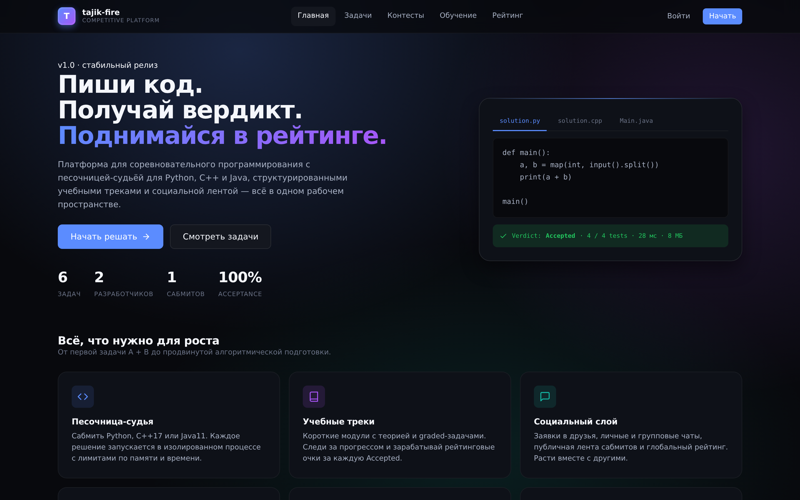
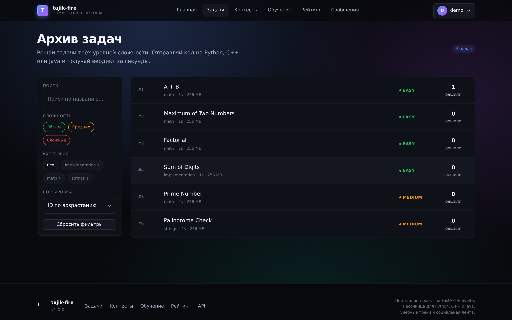
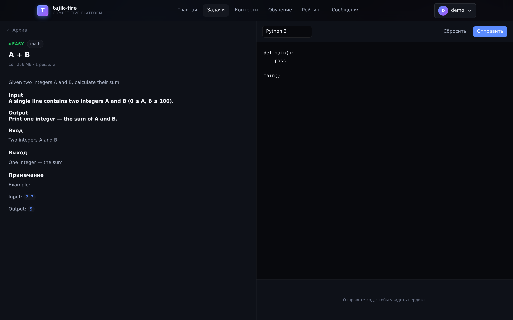
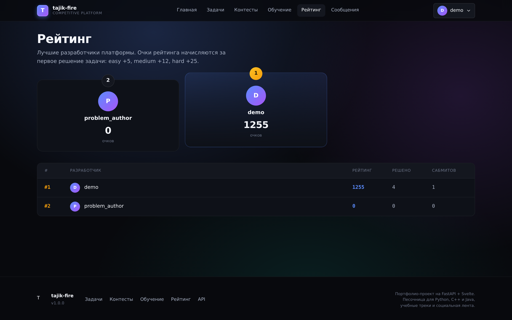
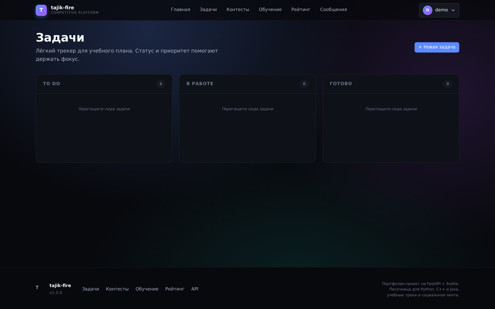
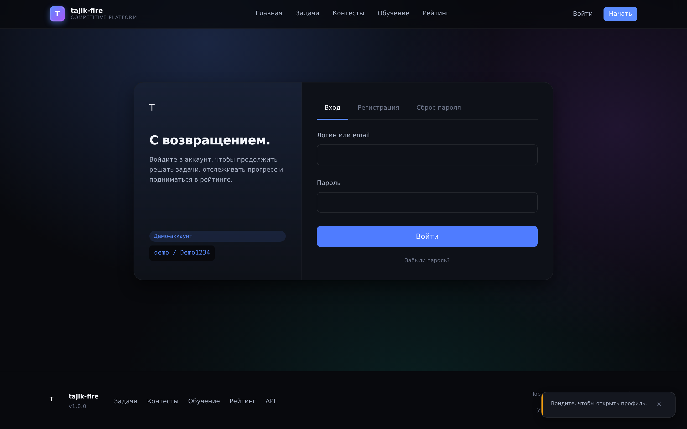

# tajik-fire

<p align="center">
  <strong>Платформа соревновательного программирования с sandbox-судьёй, учебными треками и социальной лентой.</strong>
</p>

<p align="center">
  <a href="https://github.com/Imronaxl/tajik-fire.github.io/actions"></a>
  
  
  
  
  
</p>

<p align="center">
  <a href="#возможности">Возможности</a> ·
  <a href="#скриншоты">Скриншоты</a> ·
  <a href="#архитектура">Архитектура</a> ·
  <a href="#структура-проекта">Структура</a> ·
  <a href="#языки-i18n">Языки</a> ·
  <a href="#тесты">Тесты</a> ·
  <a href="#api">API</a>
</p>

---

**tajik-fire** — платформа соревновательного программирования в духе Codeforces с трекером учёбы. Бэкенд на FastAPI проверяет решения на Python, C++ и Java в изолированном подпроцессе, фронтенд на Svelte 4 собирается в один бандл ~158 КБ (45 КБ gzip) и работает без virtual DOM.

Интерфейс пользователя по умолчанию на таджикском языке. Поддерживаются три языка: таджикский (по умолчанию), русский и английский. Переключатель языка в навбаре. Техническая документация, код и коммиты — на русском.

---

## Возможности

- **Sandbox-судья** — каждое решение запускается в изолированном процессе с `RLIMIT_AS` и wall-clock таймаутом. Python 3, C++ 17 и Java 11.
- **JWT-аутентификация** — короткий access-токен (30 мин), refresh-токен на 7 дней, throttle попыток входа, bcrypt.
- **Email опционален** — без SMTP коды подтверждения возвращаются в ответе API, так что можно разрабатывать локально без почты.
- **Многоязычность (i18n)** — интерфейс и условия задач переведены на таджикский, русский и английский. Добавление нового языка — одна строка в конфиге.
- **Лента сабмитов в реальном времени** — каждый вердикт пишется в отдельную таблицу и отображается на дашборде, главной странице и в разделе «Сабтҳо».
- **Система рейтинга** — за первое решение задачи начисляются очки: easy +5, medium +12, hard +25. Топ-3 попадают на подиум.
- **ИИ-ассистент (placeholder)** — плавающая кнопка на каждой странице, модуль AI встроен в бэкенд. Для подключения реального LLM достаточно заменить один файл `service.py`.
- **Модульная архитектура** — каждая функция (competitive, learning, social, tasks, ai) — отдельный модуль. Для добавления cybersecurity или другого типа задач просто создаёте новую папку-модуль.

---

## Скриншоты

Скриншоты сделаны на реальном запущенном приложении через Playwright (1440×900, retina). Файлы в [`docs/screenshots/`](./docs/screenshots).

<table>
  <tr>
    <td width="50%" align="center"><b>Главная</b></td>
    <td width="50%" align="center"><b>Архив задач</b></td>
  </tr>
  <tr>
    <td></td>
    <td></td>
  </tr>
  <tr>
    <td width="50%" align="center"><b>Редактор кода</b></td>
    <td width="50%" align="center"><b>Рейтинг</b></td>
  </tr>
  <tr>
    <td></td>
    <td></td>
  </tr>
  <tr>
    <td width="50%" align="center"><b>Канбан задач</b></td>
    <td width="50%" align="center"><b>Профил</b></td>
  </tr>
  <tr>
    <td></td>
    <td></td>
  </tr>
</table>

---

## Архитектура

```
┌─────────────────────────────────────────────────────────────────┐
│                            Браузер                              │
│            Svelte 4 · CSS variables · History API · i18n       │
└───────────────┬──────────────────────────────────┬──────────────┘
                │  HTTP / JSON                    │  SPA навигация
                ▼                                  ▼
┌─────────────────────────────────────────────────────────────────┐
│                          FastAPI app                            │
│                                                                 │
│  ┌─────────────────────────────────────────────────────────┐    │
│  │                     core/                               │    │
│  │   config · database · security · i18n · rate_limiter   │    │
│  └─────────────────────────────────────────────────────────┘    │
│                                                                 │
│  ┌────────────────────── modules/ ──────────────────────┐       │
│  │  accounts/   │ social/      │ competitive/           │       │
│  │  auth, users  │ messenger,   │ problems, judger,      │       │
│  │  profile,     │ friends,     │ contests, submissions  │       │
│  │  friends      │ notifications│                        │       │
│  │               │              │ learning/               │       │
│  │  analytics/   │ tasks/       │ tracks, modules          │       │
│  │  user stats  │ personal     │                         │       │
│  │               │ kanban       │ ai_assistant/ (placeholder)│   │
│  └───────────────────────────────────────────────────────┘       │
│                                                                 │
│  ┌───────────────────────────────────────────────────────┐      │
│  │              SQLAlchemy 2.0  ·  async session         │      │
│  └───────────────────────────┬───────────────────────────┘      │
│                              │                                   │
│         ┌────────────────────┴───────────────────────┐          │
│         ▼                                            ▼          │
│  ┌─────────────┐                            ┌──────────────┐    │
│  │  SQLite /   │                            │   Судья      │    │
│  │ PostgreSQL │                            │ (subprocess) │    │
│  └─────────────┘                            └──────────────┘    │
└─────────────────────────────────────────────────────────────────┘
```

Судья запускается как `asyncio`-фоновая задача на каждый сабмит: открывает новую сессию БД, выполняет код пользователя через `subprocess.run` с лимитом памяти и wall-clock таймаутом, пишет вердикт в `submissions` и добавляет запись в `submission_feed`. Фронтенд опрашивает эндпоинт сабмита до смены вердикта с `pending` / `judging` каждые 800 мс.

---

## Структура проекта

```
.
├── .github/workflows/ci.yml        # CI: ruff + smoke + judge + Docker
├── docs/screenshots/                # Скриншоты UI
├── tests/                           # Все тесты (см. раздел «Тесты»)
│   ├── conftest.py                  # общие фикстуры
│   ├── unit/                        # unit-тесты (0.2 сек)
│   ├── integration/                 # API-интеграционные (17 сек)
│   ├── e2e/                         # Playwright E2E
│   ├── load/                        # Locust нагрузочные
│   └── README.md
├── frontend/                        # Svelte 4 + Vite 5
│   └── src/
│       ├── app.css                  # дизайн-система (токены)
│       ├── App.svelte               # корневой компонент
│       ├── core/
│       │   └── i18n/                # ← ДОБАВЛЕНИЕ ЯЗЫКА ЗДЕСЬ
│       │       ├── config.js        #     список языков
│       │       ├── index.js        #     движок t('key')
│       │       └── locales/        #     tg.json, ru.json, en.json
│       ├── lib/
│       │   ├── api.js               # fetch-обёртка
│       │   ├── auth.js              # Svelte store: user, login, logout
│       │   ├── toast.js
│       │   ├── router.js            # History API
│       │   ├── utils.js             # formatDate, verdict helpers, markdown
│       │   └── components/          # Navbar, Footer, ToastStack,
│       │                            # LanguageSwitcher, AIAssistant
│       └── routes/pages/           # каждая страница — отдельный .svelte
├── fastapi_app/
│   ├── main.py                      # FastAPI app + модули
│   ├── requirements.txt
│   ├── Dockerfile                   # многоэтапная сборка
│   └── app/
│       ├── core/
│       │   ├── config.py            # pydantic-settings
│       │   └── database.py          # async engine
│       ├── api/                     # роуты по доменам
│       ├── modules/                 # ← МОДУЛЬНАЯ СТРУКТУРА
│       │   ├── registry.py          #   реестр модулей
│       │   ├── accounts/            #   auth, users, profile
│       │   ├── social/              #   messenger, friends
│       │   ├── competitive/         #   problems, judger
│       │   ├── learning/            #   tracks, modules
│       │   ├── tasks/               #   personal kanban
│       │   ├── analytics/           #   user stats
│       │   └── ai_assistant/        #   AI placeholder
│       ├── models/models.py         # 23 SQLAlchemy-модели
│       ├── schemas/                 # Pydantic v2
│       ├── services/
│       │   ├── email_service.py     # SMTP + HTML-шаблоны
│       │   ├── password_service.py
│       │   └── judger/              # судья
│       ├── middleware/rate_limiter.py
│       └── data/seed_problems.py    # демо-данные
├── docker-compose.yml
├── LICENSE
└── README.md
```

---

## Языки (i18n)

Система многоязычности централизована в одной точке — **`frontend/src/core/i18n/config.js`**.

### Добавление нового языка

Чтобы добавить язык (например, узбекский):

1. Создайте файл `frontend/src/core/i18n/locales/uz.json` (скопируйте из `tg.json` и переведите)
2. В `config.js` добавьте одну строку:

```js
export const SUPPORTED_LANGUAGES = [
  { code: 'tg', name: 'Тоҷикӣ', nativeName: 'Тоҷикӣ', file: () => import('./locales/tg.json') },
  { code: 'uz', name: 'O‘zbek', nativeName: 'O‘zbekcha', file: () => import('./locales/uz.json') },  // ← новый
  { code: 'ru', name: 'Русский', nativeName: 'Русский', file: () => import('./locales/ru.json') },
  { code: 'en', name: 'English', nativeName: 'English', file: () => import('./locales/en.json') },
];
```

Готово — язык появится в переключателе автоматически, выбор сохраняется в `localStorage`.

### Язык по умолчанию

Таджикский (`tg`). Определяется при первом визите: берётся из `localStorage`, если нет — из языка браузера, если не поддерживается — таджикский.

---

## Тесты

Папка `tests/` содержит все тесты платформы:

```
tests/
├── conftest.py                 # общие фикстуры (db, client, auth_token)
├── unit/                        # 23 unit-теста (0.2 сек)
│   ├── test_password_service.py
│   ├── test_verifiers.py        #   судья
│   ├── test_email_service.py
│   └── test_config.py
├── integration/                 # 49 integration-тестов (17 сек)
│   ├── test_auth_api.py        #   auth, JWT, password
│   ├── test_problems_api.py    #   problems, submissions
│   ├── test_tasks_api.py       #   personal tasks
│   ├── test_messenger_api.py   #   chats, messages
│   ├── test_friends_api.py     #   friend requests
│   ├── test_judger_api.py      #   judge pipeline
│   ├── test_ai_assistant_api.py
│   └── test_stats_api.py
├── e2e/                         # Playwright E2E
│   └── test_user_journey.py
└── load/                        # Locust нагрузочные
    └── locustfile.py
```

### Запуск

```bash
# Все тесты
pytest tests/unit tests/integration -v

# Только unit (0.2 сек)
pytest tests/unit -v

# Только integration (17 сек)
pytest tests/integration -v

# E2E (нужен запущенный backend)
uvicorn main:app --reload &  # in fastapi_app/
pytest tests/e2e -v

# Нагрузочные (Locust)
cd tests/load && locust -f locustfile.py --host=http://localhost:8000
```

### Покрытие

| Уровень      | Что проверяет                                            |
|--------------|----------------------------------------------------------|
| unit         | изолированные функции: пароль, вердикт, email, конфиг   |
| integration  | каждый эндпоинт API: статус-коды, ошибки, бизнес-логика |
| e2e          | UI пользовательский путь в реальном браузере           |
| load         | поведение под нагрузкой: RPS, латентность, ошибки       |

---

## API

49 эндпоинтов, задокументированы в OpenAPI.

- **Swagger UI**: <http://localhost:8000/docs>
- **ReDoc**: <http://localhost:8000/redoc>
- **Health**: <http://localhost:8000/health>

### Аутентификация

| Метод | Путь                              | Описание                                |
|-------|-----------------------------------|-----------------------------------------|
| POST  | `/api/auth/register`              | Регистрация                              |
| POST  | `/api/auth/login`                 | Вход                                     |
| POST  | `/api/auth/refresh`               | Обновление токенов                       |
| POST  | `/api/auth/logout`                | Выход                                   |
| GET   | `/api/auth/me`                    | Текущий пользователь                    |
| POST  | `/api/auth/change-password`       | Смена пароля                             |
| PUT   | `/api/auth/profile`               | Редактирование профиля                   |

### Задачи и сабмиты

| Метод | Путь                                | Описание                              |
|-------|-------------------------------------|---------------------------------------|
| GET   | `/api/problems/`                    | Список с фильтрами                     |
| GET   | `/api/problems/{id}?lang=tg\|ru\|en` | Детали с переводом                     |
| POST  | `/api/problems/submissions`          | Отправка решения                       |
| GET   | `/api/problems/submissions/{id}`    | Вердикт                                |

### AI Assistant

| Метод | Путь              | Описание                              |
|-------|-------------------|---------------------------------------|
| GET   | `/api/ai/status`  | Статус ИИ (placeholder)              |
| POST  | `/api/ai/chat`    | Чат с ИИ (placeholder-ответ)         |

---

## Быстрый старт

### Локальная разработка

```bash
git clone https://github.com/Imronaxl/tajik-fire.github.io.git
cd tajik-fire.github.io

# Бэкенд
cd fastapi_app
python -m venv .venv
source .venv/bin/activate
pip install -r requirements.txt
cp .env.example .env

# Фронтенд
cd ../frontend
npm install
npm run build

# Запуск (раздаёт фронтенд)
cd ../fastapi_app
uvicorn main:app --reload
```

Открыть: <http://localhost:8000>. Демо-аккаунт: `demo / Demo1234`.

### Dev-режим фронтенда (с HMR)

```bash
# Терминал 1: бэкенд
cd fastapi_app && uvicorn main:app --reload

# Терминал 2: Vite dev server
cd frontend && npm run dev
```

### Docker

```bash
docker compose up --build
```

---

## Конфигурация

| Переменная              | По умолчанию                          | Описание                          |
|-------------------------|---------------------------------------|-----------------------------------|
| `SECRET_KEY`            | случайный                             | JWT секрет                        |
| `DATABASE_URL`          | `sqlite+aiosqlite:///./devstudio.db` | SQLAlchemy URL                    |
| `DEBUG`                 | `true`                                | Подробные логи                    |
| `ALLOWED_ORIGINS`       | `["http://localhost:8000", …]`        | CORS allowlist                    |
| `PASSWORD_MIN_LENGTH`   | `8`                                   | Мин. длина пароля                 |
| `JUDGER_BACKEND`        | `subprocess`                          | `subprocess` или `docker`         |
| `SMTP_USER`             | (пусто)                               | SMTP логин; пусто = без почты     |
| `FRONTEND_DIST`         | `../frontend/dist`                    | Путь к собранному Svelte          |

---

## CI

GitHub Actions (`.github/workflows/ci.yml`):

1. **Backend tests** (Python 3.11 + 3.12): ruff lint + pytest (72 теста) + smoke + судья на Python и C++
2. **Frontend build** (Node 20): npm install + build + проверка размера бандла
3. **Docker image**: сборка образа + проверка `/health`

---

## Лицензия

[MIT](./LICENSE) — форкайте, шипьте, учитесь.
